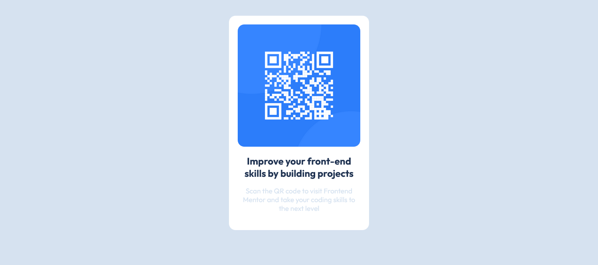

# Frontend Mentor - QR code component solution

## Table of contents

- [Overview](#overview)
  - [Screenshot](#screenshot)
  - [Links](#links)
- [My process](#my-process)
  - [Built with](#built-with)
  - [What I learned](#what-i-learned)
  - [Continued development](#continued-development)
  - [Useful resources](#useful-resources)
- [Author](#author)
- [Acknowledgments](#acknowledgments)

## Overview

### Screenshot



### Links

- Solution URL: [Add solution URL here](https://github.com/AnaMdTech/qr-code-component-card)
- Live Site URL: [Add live site URL here](https://qr-code-card-ana-md.netlify.app/)

## My process

### Built with

- Semantic HTML5 markup
- CSS custom properties
- Flexbox
- Mobile-first workflow

### What I learned

Working through this project helped me reinforce and solidify various web development concepts, including:

1. **Clean HTML structure**: I practiced creating clean and semantic HTML, ensuring accessibility and a well-structured page for the QR code component.

2. **CSS styling**: I used Flexbox to center the content and designed the layout to ensure responsiveness, especially on mobile screens.

Example code snippets:

```html
<div class="qr-code-container">
  <div class="qr-code">
    
    <h1>Improve your front-end skills by building projects</h1>
    <p>
      Scan the QR code to visit Frontend Mentor and take your coding skills to
      the next level
    </p>
  </div>
</div>
```

```css
@import url("https://fonts.googleapis.com/css2?family=Aclonica&family=Outfit:wght@100..900&family=Poppins:ital,wght@0,100;0,200;0,300;0,400;0,500;0,600;0,700;0,800;0,900;1,100;1,200;1,300;1,400;1,500;1,600;1,700;1,800;1,900&display=swap");

body {
  font-family: "Outfit";
  background-color: hsl(212, 45%, 89%);
  display: flex;
  align-items: center;
  justify-content: center;
  height: 90vh;
}

.qr-code-container {
  background-color: hsl(0, 0%, 100%);
  width: 280px;
  padding: 20px;
  border-radius: 15px;
}

img {
  width: 100%;
  height: auto;
  border-radius: 15px;
}

h1 {
  font-size: 22px;
  margin-bottom: 10px;
  text-align: center;
  color: hsl(218, 44%, 22%);
}

p {
  font-size: 16px;
  margin-bottom: 20px;
  text-align: center;
  color: hsl(212, 45%, 89%);
  font-weight: 400;
}
```

### Continued development

I plan to focus on improving my CSS skills, especially regarding animations and transitions. I also want to enhance my understanding of React and consider adding interactive functionality to QR code components, such as dynamically generating the QR code based on user input.

### Useful resources

- [Frontend Mentor QR Code Challenge](https://www.frontendmentor.io/challenges/qr-code-component-iux_sIO_H) - The challenge itself was instrumental in enhancing my front-end skills.
- [CSS Tricks - Flexbox](https://css-tricks.com/snippets/css/a-guide-to-flexbox/) - A helpful resource for learning and mastering Flexbox.

## Author

- Website - [Ana Md](https://www.your-site.com)
- Frontend Mentor - [@Ana Md](https://www.frontendmentor.io/profile/AnaMdTech)

## Acknowledgments

Special thanks to Frontend Mentor for providing this challenge and offering a platform to help improve my skills. Also, thanks to the online communities and documentation that provided invaluable insights while building this solution.
